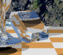
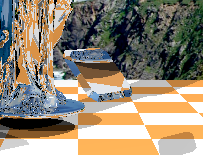

# FDU CG  Final-miniRTRender(Vulkan Compute Shader)

> **技术路径：GPU Compute Shader (Vulkan)**

> 曹琦 22307110076

[TOC]


## Part1 Implementation Approach

本项目基于25 spring FDU CG助教提供的，由*vulkan tutorial*中*compute shader*一章的粒子系统代码改进，实现了一个简单的Whitted-style 光线追踪渲染器。

vk compute shader render实现效果:


c++ 实现参考效果:


实现的整体思路和细节如下：

#### 0.BaseCode作用

助教团队提供的BaseCode 提供了一个结构完整的vulkan程序的基本框架。包括全部基础setup如创建实例、设备、交换链、命令池和帧缓冲等关键组件，配置图形管线和计算管线，使得顶点着色器、片段着色器以及计算着色器能够加载并执行。

BaseCode 还提供了一些辅助功能。在 CPU 和 GPU 侧定义了基本的材质结构体，用于描述物体表面属性，颜色、反射率、Shiness等，并通过 Uniform Buffer将这些信息传递至 Compute Shader。此外，还提供了光线与球体求交的GLSL函数，这对我后续实现光线与三角形mesh求交提供了一个清晰的思路。由于GLSL 4.50版本还不支持递归，BaseCode 中设计了一个基于栈的非递归 cast_ray 函数原型，有效避免了在 Compute Shader 中使用递归所带来的兼容性和性能问题。

BaseCode直接运行，得到的结果如下图所示。总的来说一个完整可运行的BaseCode帮我们省去了很多搭建实验环境的前期工作，有助于我们更关注算法实现本身。


#### 1. 载入背景图像

载入背景贴图的思路是：将背景图像上传为 GPU 可访问的纹理资源，并通过 `uniform sampler2D backgroundImage` 声明在着色器中进行采样，在shader的`cast_ray()`函数中，为未与场景物体相交的射线提供环境颜色。具体实现在createImageViews()函数、createTextureSampler()处：

使用图像加载库（`stb_image`）读取背景贴图文件；

创建背景图像VkImage，配置图像格式（`VK_FORMAT_R8G8B8A8_UNORM`）、尺寸等信息，创建图像对象并分配设备内存；


创建图像视图ImageView ：定义图像的访问方式和格式，用于绑定到描述符；


创建 sampler：设置纹理过滤与寻址模式


更新Descriptor Set ：将图像视图和采样器绑定到描述符集中的对应绑定点；


在 Compute Shader 中采样背景贴图：通过 `texture()` 函数使用射线方向映射到球形或立方体贴图坐标，获取背景颜色。


为了实现对提供的2D 全景贴图进行采样，实现一个shader函数，将光线方向向量映射为背景纹理的 UV 坐标


>  这里参考帖子[5.球面纹理贴图_imgui 绘制3d球型纹理-CSDN博客](https://blog.csdn.net/masilejfoaisegjiae/article/details/105804301)


#### 2. 物体几何变换

在 CPU 端导入模型数据（调用`loadObjAsTriangles()`）后，对每个三角形执行缩放，旋转，平移变换，并将变换后的顶点数据上传至 GPU 的缓冲区供着色器访问。

调用GLM提供的函数构建变换矩阵


物体的变换信息以全局变量形式存放在config.hpp的ModelInfo对象中


#### 3. 模型三角形数组导入compute shader

首先，在 CPU 端使用模型加载库 `tiny_obj_loader`解析模型文件，提取顶点和索引数据，并将其组织为包含每个三角形顶点位置的数组；

创建一个 GPU 可访问的缓冲区`VkBuffer`，并为其分配设备内存，将三角形数据上传至该缓冲区；

接着在着色器中声明只读的缓冲区接口（ `layout(std140, binding = 5) readonly buffer TriangleSSBO`），并与描述符集绑定；

最后，在 Compute Shader 中通过索引方式访问该数组，执行光线与三角形的相交计算。

createShaderStorageBuffers()


由于GLSL不支持嵌套数组，故这里将所有模型的三角形都放在一个统一的三角形数组中传入，再通过另一个结构管理不同模型的包围盒等其他信息。详细说明见**Part3-2**


#### 4. 轴对齐包围盒AABB

在 CPU 端导入模型时为每个模型预计算其包围盒的最小和最大顶点坐标 ，并将这些信息封装在 `Model` 结构体中，通过 SSBO上传至 GPU；


利用了分离轴定理（Separating Axis Theorem），通过计算光线原点 `orig` 沿方向 `dir`与包围盒边界 `bboxMin` 和 `bboxMax` 的交点，分别求出进入和离开包围盒的距离 `tmin` 和 `tmax`；然后根据这些值计算出光线穿过 AABB 的最近和最远距离 `tNear` 和 `tFar`，若 `tNear <= tFar` 且 `tFar > MIN_EPSILON`，说明光线确实穿过了该包围盒，返回 `true`，否则返回 `false`。


在 Compute Shader 的光线和场景求交函数中，先判断是否与 AABB相交再进一步计算三角形相交 ，以加速光线与模型的相交判断，从而提升整体光线追踪性能。


#### 5. 光线三角形求交与场景遍历

在shader中通过Möller–Trumbore算法实现光线与三角形求交

> 参考帖子[[数学\] Möller–Trumbore 算法 - 知乎](https://zhuanlan.zhihu.com/p/451582864)


```glsl
bool ray_triangle_intersect(vec3 orig, vec3 dir, Triangle tri, int normalinterpolation, out float t, out vec3 normal) {
    vec3 v0 = tri.v0.xyz;
    vec3 v1 = tri.v1.xyz;
    vec3 v2 = tri.v2.xyz;
    vec3 edge1 = v1 - v0;
    vec3 edge2 = v2 - v0;
    // 计算光线方向和第一个边的叉积（P）
    vec3 h = cross(dir, edge2);
    float a = dot(edge1, h);
    // 如果 a 接近 0，光线和平面平行
    if (a > -MIN_EPSILON && a < MIN_EPSILON)
        return false;

    float f = 1.0 / a;
    // 计算从原点到顶点的向量
    vec3 s = orig - v0;
    // 计算 u 参数
    float u = f * dot(s, h);
    if (u < 0.0 || u > 1.0)
        return false;
  
    // 计算第二个叉积（Q）
    vec3 q = cross(s, edge1);
    // 计算 v 参数
    float v = f * dot(dir, q);
    if (v < 0.0 || u + v > 1.0)
        return false;
    // 计算交点距离 t
    t = f * dot(edge2, q);

    if (t <= MIN_EPSILON)
        return false;

    // 设置法线
    if (normalinterpolation == 0) {
        // 使用平面法线（Flat Shading）
        normal = normalize(cross(edge1, edge2));
    } else {
        // 使用重心坐标顶点法线插值（Smooth Shading）
        float w = 1.0 - u - v;
        normal = normalize(w * tri.v0_norm.xyz + u * tri.v1_norm.xyz + v * tri.v2_norm.xyz);
    }

    return true;
}
```

场景遍历在shader中通过`scene_intersect()`函数中串行执行，首先初始化一个最近交点结构体，随后依次检测光线是否与地板相交，若满足条件则更新最近交点信息；对一组球体进行循环检测，保留距离最近的有效交点；遍历加载的模型对象，利用 AABB 包围盒进行初步剔除，仅对可能相交的模型对应的三角形数组进行精确求交计算，以提升性能。每个模型的三角形索引范围由参数指定，函数从中取出对应三角形并逐个进行光线追踪测试，一旦发现更近的有效交点，则更新当前最近交点的数据。

#### 6. 顶点法向平滑与重心坐标插值

首先对仅包含三个顶点位置的 `Triangle` 结构体修改为包含每个顶点的位置、法向量


在加载模型数据后，根据模型是否开启Normalinterpolation选项决定是否预计算顶点法向；

预计算实现思路：为每个唯一的顶点位置（以 顶点`glm::vec4` 作为键，使用自定义的异或哈希函数）维护一个累加的法向量；遍历所有三角形，对每个三角形的三个顶点累加其对应的面法线（通过叉乘计算）；最后对每个顶点的累加法向进行归一化，并将结果写入对应三角形结构体的顶点法线字段中，供后续在着色器中插值使用。在这里由于glm vec4使用的是float存储数据，所以使用异或导致不同顶点哈希到同一个值的碰撞概率很小。


这些数据随着三角形SSBO上传到GPU端由shader调用；

在计算光线与三角形交点时，使用经典的 Möller–Trumbore 算法恰好会计算出该交点对应的重心坐标参数 `u` 和 `v`（其中 `w = 1 - u - v`）作为中间变量，利用这一点可以轻松完成对交点法向的重心坐标插值。


对玻璃鸭子开启平滑的效果：


#### 7. 材质设定

项目沿用了tinyraytracer中的材质参数设定


| 分量        | 含义                         | 说明                                 |
| ----------- | ---------------------------- | ------------------------------------ |
| `Albedo.x` | 漫反射（Diffuse）强度系数    | 控制漫反射成分的强弱，0 表示无漫反射 |
| `Albedo.y`         | 高光反射（Specular）强度系数 | 控制镜面高光部分的亮度               |
| `Albedo.z`         | 反射（Reflection）贡献系数   | 控制反射光线对最终颜色的影响程度     |
| `Albedo.w`         | 折射（Refraction）贡献系数   | 控制折射光线对最终颜色的影响程度     |
| `diffuse_specular.r`  | 红色通道 | 决定物体在漫反射光照下的红色分量 |
| `diffuse_specular.g`  | 绿色通道 | 决定物体在漫反射光照下的绿色分量             |
| `diffuse_specular.b`  | 蓝色通道 | 决定物体在漫反射光照下的蓝色分量             |
| `diffuse_specular.a`  | Shiness | 控制镜面反射的锐利程度，即高光区域的集中程度 |
| `refractive` | 折射率 | 控制光线穿过表面时的方向变化 |

材质信息在导入三角形时一并写入到了triangle对象中，通过SSBO上传到GPU由shader调用；

shader在cast_ray函数实现了基于材质属性的光线追踪路径积分


所有模型的配置参数均在config.hpp中定义便于调整：


## Part2 Issues and Resolutions

#### 1. 面片渲染时缺失

问题：在导入三角形较小的高模如venus后，出现了一些面片丢失的问题如下图所示。


解决：经过排查确定，模型的三角形数组在上传到GPU后并没有出现数据丢失，故推测是由浮点运算精度导致光线三角形求交时误将相交的面计算为不相交。最终确定问题出现在shader中一个参数的配置上：

```glsl
const float MIN_EPSILON = 0.001;
```

`MIN_EPSILON`是一个数值稳定性参数 ，其核心作用是避免光线与表面的自相交（self-intersection）问题，在光线与物体相交后，为了避免后续生成的反射/折射/阴影光线从表面出发时因浮点精度问题误判为与同一物体相交，会将光线起点沿法线方向偏移一个 `MIN_EPSILON` 的微小距离；


当 `MIN_EPSILON` 过大时，光线起点会被推离表面一个较大的距离。而在venus这种高模模型（有复杂的mesh、锐利边缘）中，偏移可能导致光线起点“穿透”到模型的另一侧，跳过原本应渲染的几何部分；也有可能偏移方向可能与相邻面的法线方向冲突，导致错误遮挡。也就引起了问题中了一些面片缺失的效果。

于是我将默认值的`1e-4`调整到更小的`1e-7`，却发现出现了新的问题--远距离物体出现黑点,如下图所示：


分析原因是当 `MIN_EPSILON` 过小时（低于了float的精度），就会导致偏移量不足，光线起点可能仍位于表面“内部”，造成了自相交，这些黑点就是错误绘制的阴影。

我的解决方案：

先将`MIN_EPSILON`调整到比较合理的值`1e-5`，

使用动态 `EPSILON`，根据着色点距离计算,

近距离 ：使用小偏移，保持几何精度。
远距离 ：适当增大偏移，避免浮点精度问题。

```glsl
float getDynamicEpsilon(float distance) {
    // 基础偏移 + 距离比例因子 × 着色点距离摄像机距离
    return MIN_EPSILON + 0.0001 * distance;
}
```

最终效果见文档中展示的效果图

#### 2. 多模型管理--GLSL 不支持嵌套数组作为 SSBO中的成员变量

问题：为了实现管理多个模型的不同信息：如该模型的三角形数组，其AABB参数，是否开启法向平滑等；我需要将不同模型的信息打包到结构体Model中，再将信息通过SSBO上传至GPU，但是GLSL不支持这种嵌套数组结构，因此无法直接在着色器中声明类似 C++ 中 `Triangle models[][]` 的结构

```glsl
// GLSL 不支持 嵌套数组
struct Model {
    Triangle triangles[];
    glm::vec4 bboxMin;
	glm::vec4 bboxMax;
    bool normalinterpolatio;
	Material material;
};

Model models[];
```

解决：扁平化存储 + 索引管理

**将所有模型的三角形合并为一个全局三角形数组**

```glsl
layout(std140, binding = 5) readonly buffer TriangleSSBO {
    Triangle triangles[];
};
```

所有模型共享这一个大数组，每个模型只需要记录自己在该数组中的起始索引和三角形数量

**定义模型结构体，包含起始索引与三角形数量**

```glsl
struct Model
{	// 为了满足std140 布局的对齐规则将前三个参数整合到params0中
	ivec4 params0; // x=startIndex, y=count, z=normalinterpolatio (0/1), w=padding
	//int startIndex:起始索引
	//int count:三角形数量
	//bool normalinterpolatio:是否启用表面平滑
	vec4 bboxMin;
	vec4 bboxMax;
	Material material;
};
```

通过这种管理方式，在场景遍历时就可以以如下形式遍历每个模型的三角形了。

```glsl
 for(int i = 0; i < models.length(); i++){
     if(ray_aabb_intersect(orig, dir, invDir, models[i].bboxMin.xyz, models[i].bboxMax.xyz)){
         int startindex = int(models[i].params0.x); 
         int count = int(models[i].params0.y);
         int endindex = startindex + count;
         int normalinterpolation = int(models[i].params0.z);
         for (int j = startindex; j < endindex; j++){
             ......
         }
```


#### 3. 针对多面高模的渲染速度较慢 : AABB 展开

问题：导入维纳斯这种有上万个三角面的模型后，遍历效率非常低下，仅依赖单个模型级别的 AABB加速结构已无法显著提升效率，因为每次光线进入该包围盒后仍需遍历其全部三角形，无法有效剔除大量不可能相交的几何体。

优化前帧率约为每秒2帧：


解决：本项目采用了一种简化的，基于批次（batch）的细分包围盒策略：将每个模型内部的三角形每 `batch_size`个划分为一个批次，并为每个批次单独构建一个局部的 AABB 包围盒。这样，光线在进入模型整体包围盒后，会进一步判断是否与某个三角形批次的包围盒相交，只有通过该粗略剔除阶段的批次才会被进一步展开并执行精确的三角形级求交运算。


选择每64个三角形面作为一个包围盒bacth优化效果,平均帧率提升近5倍


#### 4. 全反射逻辑修正

问题：原有的实现方案中发生全反射时，逻辑是向（1，0，0）方向发射一条折射光线。导致宝石上发生全反射的面的视觉效果不符合物理。


解决：在`custom_refract()`函数处，发生全反射时返回0向量，由`cast_ray()`函数做特殊处理处理，发生全反射时，仅保留一条全反射的光线进行采样。


#### 5. 宝石渲染效果不一致

问题：在对比最中效果时，发现宝石的上表面渲染效果与参考图不同，

   （参考图）



（我的实现）


检查全反射逻辑、光线offsetting设置，非递归实现多次折射逻辑均没有问题。

从物理直觉上来分析，宝石的上表面的成像不应该像参考图那样平整。应该需要反映出宝石背部的结构。

于是我将宝石的模型下侧顶点去除后做了实验：


得出了和参考图一致的结果



故我认为参考图可能没有正确处理光线在宝石内部多次折射反射形成的效果，仅计算了在宝石上表面的一次折射。

造成这种问题的可能原因是参考图使用了backface culling来做加速，剔除了宝石背面的结构，导致raytracing时没有计算到。

于是我在我的项目中尝试实现了一个粗糙的backface culling，剔除掉所有背朝摄像机的面也得到了类似参考图的效果：


但是我认为在ray tracing中做背面剔除是不合理的，即透明的宝石需要呈现出其背部的结构对光线的影响效果，如下图所示


而**不应该**是这样：


故最后我保留了我的实现效果，不做修改。


> end

