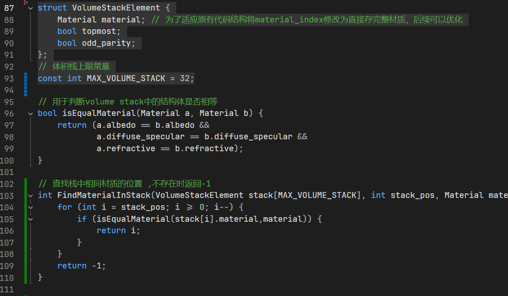
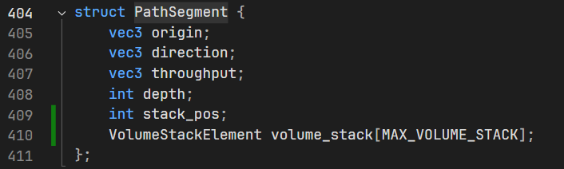
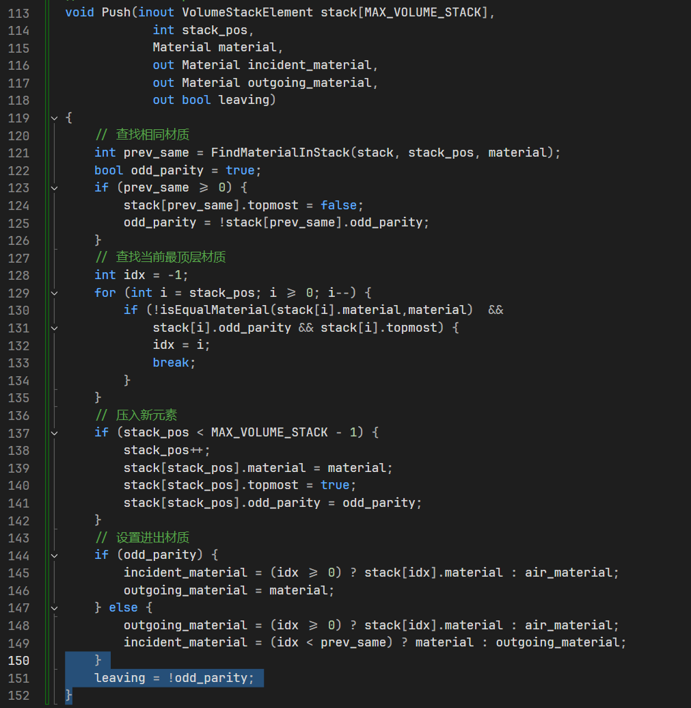
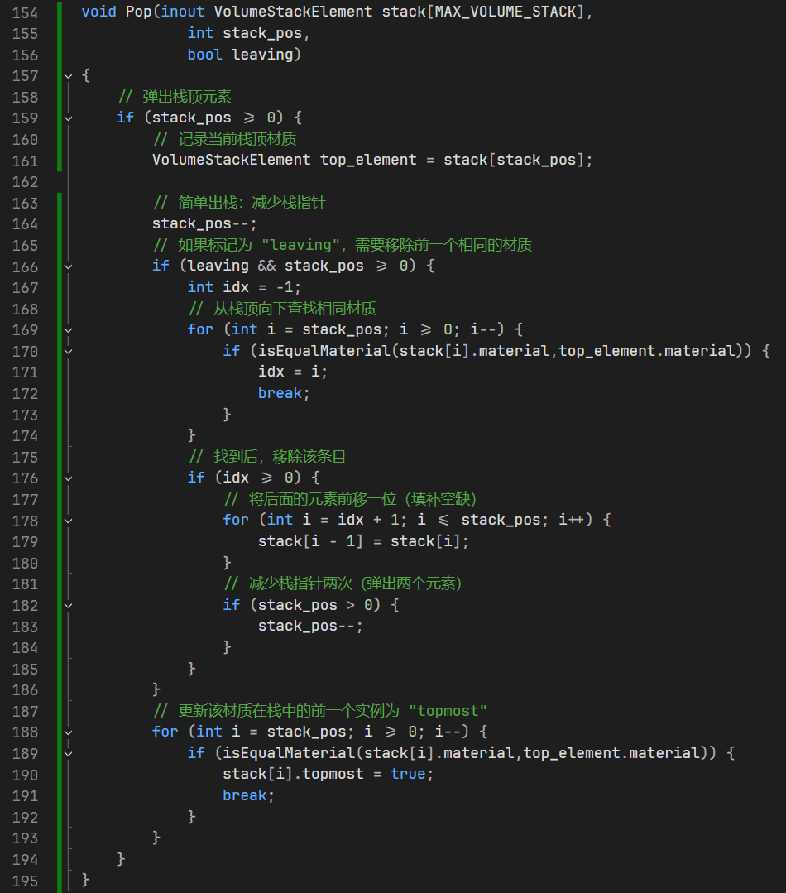
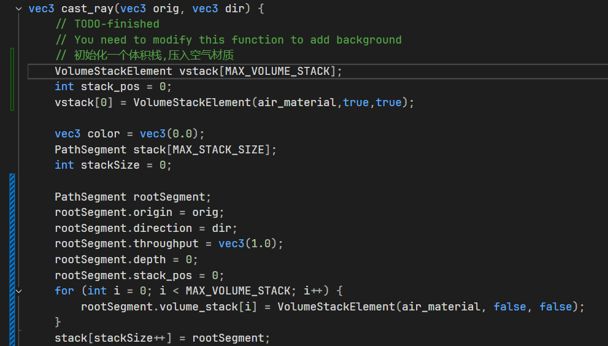
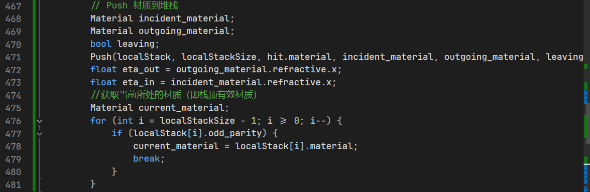
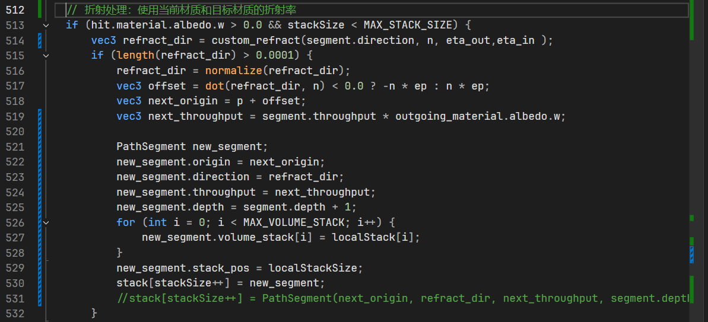
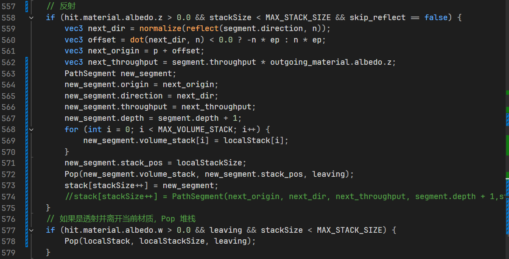
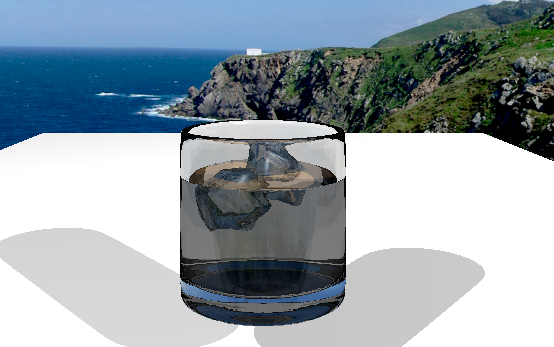

# MiniRTRender New Feature--基于Volume Stack机制 自动处理嵌套体积

> 曹琦 FDU Software Engineering 22307110076

## 问题

光线追踪渲染在处理多个嵌套或重叠透明介质时，如何正确识别当前光线所处的材质环境是一个关键问题。传统的建模方式要求由建模者手动定义复杂的界面或在体积间留下微小空隙，不仅增加了制作成本，而且在动画或动态场景中难以维护。如果模型本身的重叠不做特殊处理则会出现视觉效果的错误。

Ray Tracing Gems CH11 提出volume Stack自动处理机制 ，通过在光线追踪过程中动态维护一个材质状态栈，实现了对嵌套和重叠体积的自动识别与管理。该机制根据材质在栈中出现次数的奇偶性判断光线是否处于某一体积内部，并结合微小重叠策略避免了手动的优先级设定。

## 测试场景

为观察和验证Volume Stack机制在嵌套透明材质中的表现，我在Mini compute shader RTRender 项目中构建了一个包含玻璃杯、威士忌液体和漂浮冰块的测试场景。在建模过程中，我有意让威士忌液体与玻璃杯之间存在微小重合区域，以模拟真实渲染中可能出现的建模重叠。

<figure>

    
    <figcaption>图1：玻璃杯+威士忌+冰块，未引入体积栈机制</figcaption>

</figure>

<figure>

	    
    <figcaption>图2：玻璃杯</figcaption>

</figure>

<figure>

	    
    <figcaption>图3：威士忌</figcaption>

</figure>

<figure>

	    
    <figcaption>图4：冰块</figcaption>

</figure>

场景中涉及到不同材质的折射率数值设置如下：

- 空气：IOR = 1.0
- 玻璃 ：IOR = 1.5
- 威士忌（液体） ：IOR = 1.36
- 冰块 ：IOR = 1.31
### 目标效果

目标是通过修改原始代码引入体积栈机制，在原有建模体积有嵌套的情况下，实现建模体积留有air gap的视觉效果。

<figure>

	    
    <figcaption>图5：调整建模留下air gap，折射效果正确</figcaption>

</figure>

## 算法

维护一个所有当前活跃（嵌套）材质的栈结构 。每当光线与一个表面相交时，我们将该表面的材质压入栈中，并确定当前边界在入射侧和背面所对应的材质。 基本思想是：如果某个材质在栈中出现的次数为奇数次 ，则表示当前处于该体积内部；若为偶数次，则表示已退出该体积。由于我们假设体积之间存在重叠，栈的处理还需要确保：在路径上沿着两个重叠表 面移动时，只有其中一个表面被认定为体积边界。我们通过检查是否在进入当前材质之后又进入了另一 种材质，来过滤掉第二个边界。

在每个栈元素中存储两个标志位：

- 一个标志位表示该栈元素是否是该材质的最顶层引用 ； 

- 另一个标志位表示该材质被引用的次数是奇数次还是偶数次 。 

完成着色并继续追踪路径，需要区分以下三种情况：

1. 对于反射情况，我们从栈中弹出最顶层的元素，并更新该材质在栈中上一次出现实例 的“最顶层标志位”。
2.  对于透射情况，如果判断光线已经离开最新压入栈的材质，我们不仅需要弹出栈顶元素，还需要移除该材质之前的引用记录 。
3.  对于相同材质之间的边界（应被跳过）以及判断为进入新材质的透射情况，保持栈不变 。

需要注意的是，在路径轨迹发生分裂的情况下，每条生成的光线都需 要拥有独立的材质栈。 当摄像机本身位于某个体积内部时，还需要初始化一个材质栈，以反映该体积的嵌套状态。为了构建这个初始栈，可以从场景包围盒外部向摄像机位置递归地发射一条光线，并根据其与各体积的交点来填充 栈结构。

## 实现

体积栈的逻辑集中实现在compute shader中，参考RT Gems代码中给出了的栈结构

#### 1. 定义栈结构，实现工具函数

#### 2.修改PathSegment结构体

由于在路径轨迹发生分裂的情况下，每条生成的光线都需要拥有独立的材质栈。故我在这里考虑把volume stack信息保存在用于递归的`PathSegment`结构体中

#### 3.新增体积栈操作函数（push pop）

#### 4. 修改`cast_ray()`函数

在 `cast_ray()` 初始化根路径段时：初始化体积栈为空，所有材质条目标记为无效（默认材质、`topmost=false`、`odd_parity=false`），表示初始处于外部介质（如空气）中。

在求到光线场景交点后调用 `Push()` 更新堆栈：复制父PathSegment的堆栈到局部变量（避免污染原始堆栈）。

调用 `Push()` 根据当前材质更新堆栈状态，判断进入或退出体积（通过 `odd_parity` 和 `leaving`）。并在折射计算前，获取当前所处材质前后的折射率：

在折射路径中传递更新后的栈

在反射路径中（包括全反射）调用 `Pop()`，透射离开材质时调用 `Pop()`

## 最终实现效果

引入体积栈机制后看起来并没有明显的视觉变化，可能代码实现还有corner case没有考虑。

<figure>

	   
    <figcaption>图6：引入Volume stack机制后的效果</figcaption>

</figure>
