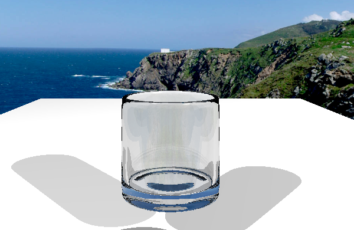

# MiniRTRender New Feature--基于Volume Stack机制 自动处理嵌套体积

> 曹琦 FDU Software Engineering 22307110076

## 问题

光线追踪渲染在处理多个嵌套或重叠透明介质时，如何正确识别当前光线所处的材质环境是一个关键问题。传统的建模方式要求由建模者手动定义复杂的界面或在体积间留下微小空隙，不仅增加了制作成本，而且在动画或动态场景中难以维护。如果模型本身的重叠不做特殊处理则会出现视觉效果的错误。

Ray Tracing Gems CH11 提出基于volume Stack的材质自动处理机制 ，通过在光线追踪过程中动态维护一个材质状态栈，实现了对嵌套和重叠体积的自动识别与管理。该机制根据材质在栈中出现次数的奇偶性判断光线是否处于某一体积内部，并结合微小重叠策略避免了繁琐的手动优先级设定。

## 算法

维护一个所有当前活跃（嵌套）材质的栈结构 。每当光线与一个表面相交时，我们将该表面的材质压入栈中，并确定当前边界在入射侧和背面所对应的材质。 基本思想是：如果某个材质在栈中出现的次数为奇数次 ，则表示当前处于该体积内部；若为偶数次，则表示已退出该体积。由于我们假设体积之间存在重叠，栈的处理还需要确保：在路径上沿着两个重叠表 面移动时，只有其中一个表面被认定为体积边界。我们通过检查是否在进入当前材质之后又进入了另一 种材质，来过滤掉第二个边界。

为了提高效率，我们在每个栈元素中存储两个标志位：

- 一个标志位表示该栈元素是否是该材质的最顶层引用 ； 

- 另一个标志位表示该材质被引用的次数是奇数次还是偶数次 。 

一旦完成着色并继续追踪路径，我们需要区分以下三种情况：

1. 对于反射情况，我们从栈中弹出最顶层的元素，并更新该材质在栈中上一次出现实例 的“最顶层标志位”。
2.  对于透射情况（例如折射），如果判断光线已经离开最新压入栈的材质，我们不仅需要弹出栈顶元素，还需要移除该材质之前的引用记录 。
3.  对于相同材质之间的边界（这些边界应当被跳过）以及判断为进入新材质的透射情况，我们保持栈不变 。

需要注意的是，在路径轨迹发生分裂的情况下，每条生成的光线都需 要拥有独立的材质栈。 当摄像机本身位于某个体积内部时，还需要初始化一个材质栈，以反映该体积的嵌套状态。为了构建这 个初始栈，可以从场景包围盒外部向摄像机位置递归地发射一条光线，并根据其与各体积的交点来填充 栈结构。

## 实现

